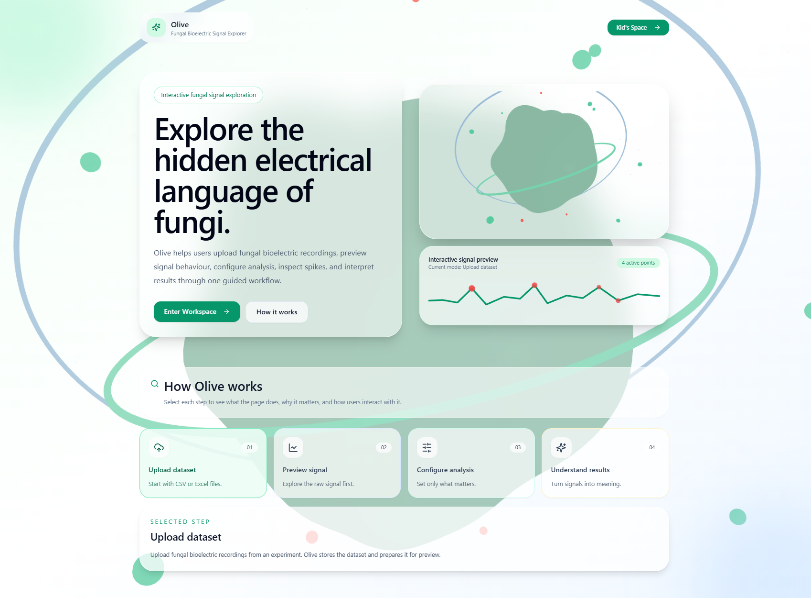
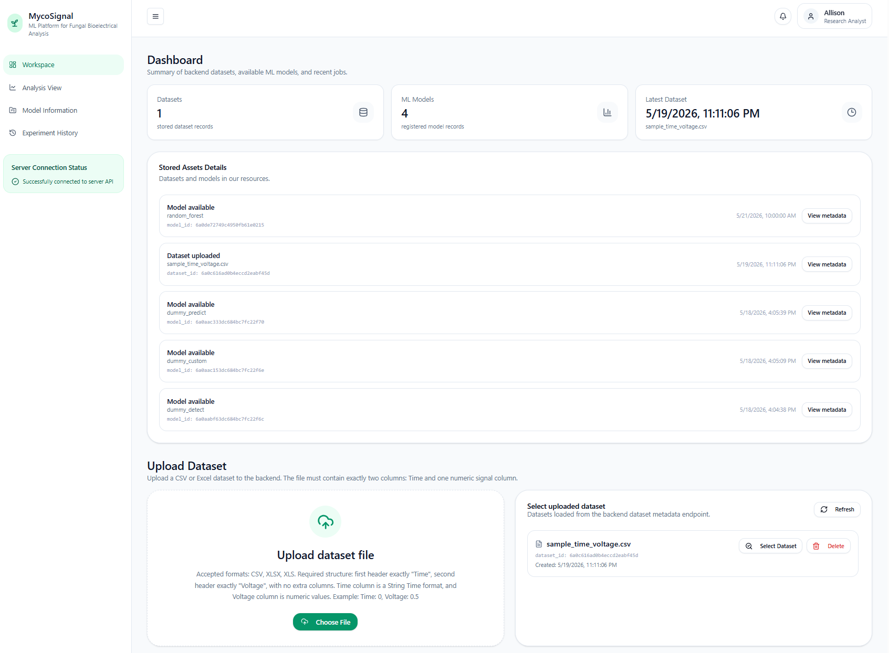
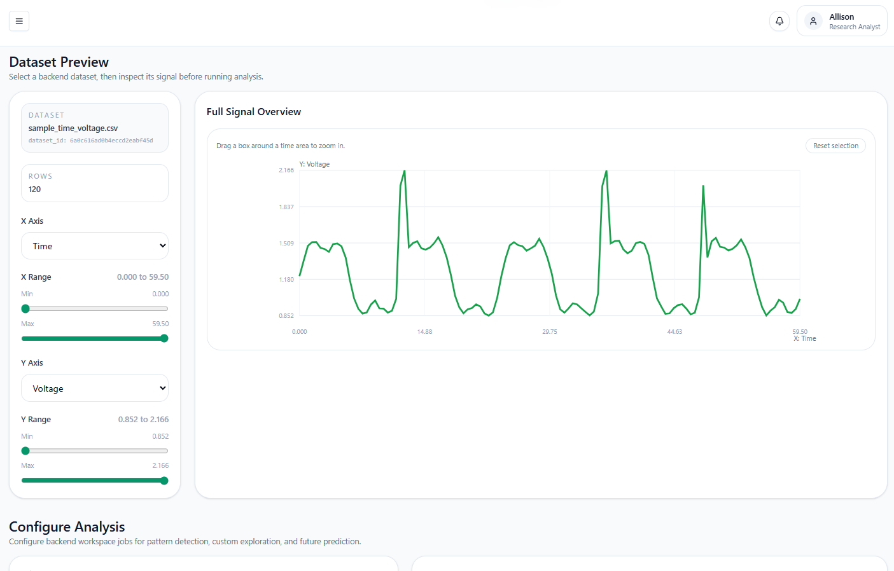
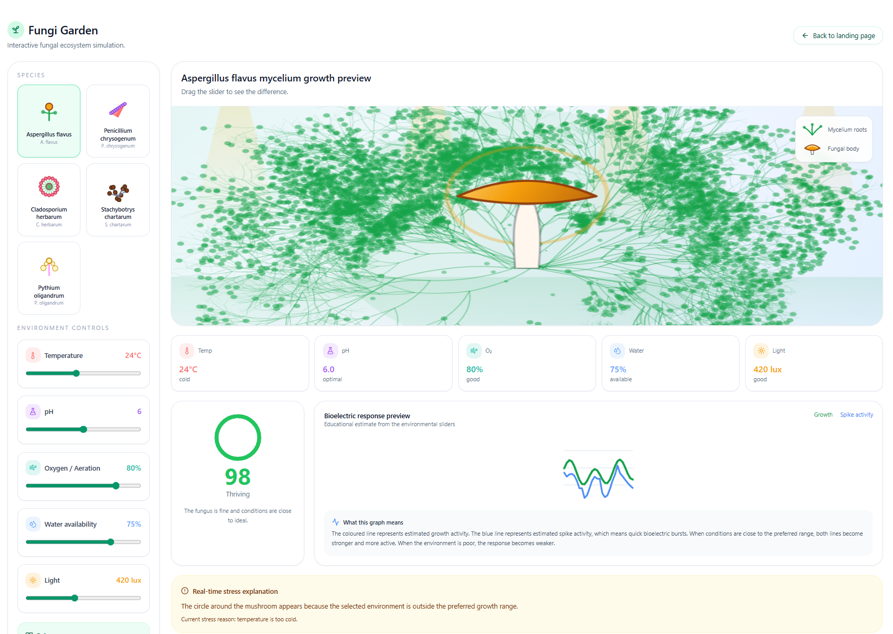

# MycoSignal: Fungal Bioelectric Signal Analysis Platform

**Team Olive — DECO3801, University of Queensland**

---

## Demo

> **Video Demo** can be provided upon request

---

## Introduction

Fungi generate spontaneous bioelectrical signals — trains of action-potential-like spikes measurable in the millivolt range across mycelial networks. These signals carry information about metabolic state, environmental response, and inter-hyphal communication, but their low amplitude, irregular timing, and noise make manual analysis impractical at scale.

This platform provides a structured, end-to-end pipeline for fungal bioelectric signal analysis. Researchers can upload raw electrical recordings (CSV or XLSX), configure analysis parameters, run real machine learning models against the signal, and receive interpreted results through an interactive web interface.
<p align="center">
  
</p>

<table align="center">
  <tr>
    <td align="center">
      
      <br>
      <sub>Get Started Page</sub>
    </td>
    <td align="center">
      
      <br>
      <sub>Dashboard View</sub>
    </td>
  </tr>
  <tr>
    <td align="center">
      
      <br>
      <sub>Dataset Preview</sub>
    </td>
    <td align="center">
      
      <br>
      <sub>Garden View</sub>
    </td>
  </tr>
</table>

The three core analysis modes are:

- **Detect Patterns** — identifies spike events, oscillations, and recurring signal structures
- **Custom Exploration** — configurable analysis over a user-defined time window
- **Predict Future Behaviour** — forecasts voltage values over a prediction horizon

The system is built as a full-stack, multi-service application. ML inference is real — no mock results in production. Models are trained on real ADC recordings from fungal specimens and served through a dedicated Python inference service.

---

## Quick Start

Four services need to be configured and running for the full pipeline. The minimum setup for local development:

**Step 1 — Clone**

```bash
git clone https://github.com/justcallmeHao/DECO3801-FungiPatternAnalysis.git
cd DECO3801-FungiPatternAnalysis
```

**Step 2 — Configure environment variables**

Copy and fill in the `.env` files for each service (see [Environment Variables](#environment-variables) below).

**Step 3 — Install dependencies**

```bash
cd backend && npm install && cd ..
cd frontend && npm install && cd ..
cd ml-service && python -m venv .venv && .venv\Scripts\activate && pip install -r requirements.txt && cd ..
```

**Step 4 — Start all services** (four terminals)

| Terminal | Command | Address |
|---|---|---|
| 1 | `cd backend && npm run start:all` | `http://localhost:5000` |
| 2 | `cd ml-service && uvicorn app.main:app --reload --port 8001` | `http://localhost:8001` |
| 3 | `cd frontend && npm run dev` | `http://localhost:5173` |

`npm run start:all` starts both the backend API and background worker together. To run them separately, use `npm run dev` (API) and `npm run worker:dev` (worker) in separate terminals.

---

## Project Structure

```
DECO3801-FungiPatternAnalysis/
├── frontend/                        # React + Vite web interface
├── backend/                         # Node.js Fastify API + BullMQ worker
├── ml-service/                      # Python FastAPI inference service
│   └── pre-built-training-scripts/  # ML model training pipelines (3 contributors)
│       ├── hao_models/              # RF, CNN, LSTM — scikit-learn wrappers
│       ├── kanon_models/            # K-Means, HMM, LSTM — hmmlearn + PyTorch
│       └── lucky_models/            # K-Means, HMM, LSTM — PyTorch
├── readme/                          # Project images
├── README.md                        # This file
└── TROUBLESHOOTING_GUIDE.md         # Common failure diagnosis
```

### Sub-READMEs

Each service has its own detailed README. Read these before setting up or testing:

| Service | README | Contents |
|---|---|---|
| Frontend | [frontend/README.md](frontend/README.md) | Tech stack, pages, env vars, workspace flow, client-side signal processing |
| Backend | [backend/README.md](backend/README.md) | Stack, architecture, env vars, Postman test guide, all API endpoints, service verification |
| ML Service | [ml-service/README.md](ml-service/README.md) | Endpoints, adapter contract, inference pipeline, dummy models, model upload paths |

### Training Scripts

Pre-built training pipelines are in `ml-service/pre-built-training-scripts/`. Each contributor's folder has its own README explaining the data required, training commands, produced artifacts, and how to run a smoke test:

| Folder | README | Models produced |
|---|---|---|
| `hao_models/` | [README](ml-service/pre-built-training-scripts/hao_models/README.md) | `rf_pattern_detection.pkl`, `cnn_custom_exploration.pkl`, `lstm_predict_future.pkl` |
| `kanon_models/` | [README](ml-service/pre-built-training-scripts/kanon_models/README.md) | `kmeans.pkl`, `hmm_model.pkl`, `scaler.pkl`, `lstm_model.pth`, `config.pkl` |
| `lucky_models/` | [README](ml-service/pre-built-training-scripts/lucky_models/README.md) | `kmeans.pkl`, `hmm_model.pkl`, `scaler.pkl`, `lstm_model.pth`, `config.pkl` |

After training, upload model artifacts to Supabase via `POST /models/upload` on the backend. For large files, see the manual upload path in [ml-service/README.md](ml-service/README.md#large-model-path--manual-supabase-upload--mongodb-document).

---

## System Architecture

```text
Browser (React)
  → backend API (Fastify, Node.js)          — port 5000
      → MongoDB Atlas                        — metadata, jobs, results
      → Redis Cloud / BullMQ                 — job queue
  → backend worker (BullMQ consumer)
      → Supabase Storage                     — dataset + model files
      → Python ML service (FastAPI)          — port 8001
          → real model inference
          → structured result payload
  → frontend polls job → fetches result → renders output
```

| Layer | Technology | Hosted on |
|---|---|---|
| Frontend | React 18, Vite, Tailwind CSS, Three.js | Vercel (Optional) |
| Backend API + Worker | Node.js, Fastify, BullMQ | Render (Optional) |
| ML Service | Python, FastAPI, scikit-learn, PyTorch | Render (Optional) |
| Database | MongoDB Atlas | MongoDB Cloud |
| Queue | Redis + BullMQ | Redis Cloud |
| File Storage | Supabase Storage | Supabase |

---

## Environment Variables

Each service needs its own `.env` file. Copy `.env.example` where available, then fill in real values.

### `backend/.env`

```env
PORT=5000
CLIENT_URL=http://localhost:5173
CORS_ORIGIN=http://localhost:5173
NODE_ENV=development

MONGODB_URI=mongodb+srv://<username>:<password>@<cluster-url>/<database-name>
REDIS_URL=redis://default:<password>@<hostname>:<port>

SUPABASE_URL=https://your-project.supabase.co
SUPABASE_SERVICE_ROLE_KEY=your-service-role-key
SUPABASE_DATASETS_BUCKET=datasets
SUPABASE_MODELS_BUCKET=models
SUPABASE_SIGNED_URL_EXPIRES_SECONDS=3600

ML_SERVICE_URL=http://localhost:8001
ML_REQUEST_TIMEOUT_MS=120000

OPENAI_API_KEY=your-openai-api-key
OPENAI_MODEL=gpt-4o-mini
```

### `ml-service/.env`

```env
APP_ENV=development
LOG_LEVEL=INFO
REQUEST_TIMEOUT_SECONDS=120

MONGODB_URI=mongodb+srv://<username>:<password>@<cluster-url>/<database-name>
MONGODB_DATABASE=fungipatternanalysis

SUPABASE_URL=https://your-project.supabase.co
SUPABASE_SERVICE_ROLE_KEY=your-service-role-key
```

### `frontend/.env`

```env
VITE_API_URL=http://localhost:5000
VITE_ML_URL=http://localhost:8001
```

Full variable descriptions are in each service's README.

---

## Deployment

The system deploys as four separate services. All infrastructure is free-tier compatible for demos, though free-tier Redis and Render instances have performance and availability limits.

### MongoDB Atlas

1. Create a free cluster and a database user
2. Under **Network Access**, add `0.0.0.0/0` (all IPs) for development, or restrict to specific IPs for production
3. Copy the connection string as `MONGODB_URI`

### Supabase Storage

1. Create a Supabase project
2. Under **Storage**, create two buckets: `datasets` and `models`
3. For temporary testing, buckets can be made public. For production, keep them private and rely on signed URL generation
4. Copy the project URL and service role key

### Redis Cloud

1. Create a free Redis database
2. Copy the connection string as `REDIS_URL`

### Backend API + Worker

Deploy two separate Web Services from the same repository:

**Backend API service:**
- Root directory: `backend`
- Build command: `npm install && npm run build`
- Start command: `npm start`

**Backend Worker service:**
- Root directory: `backend`
- Build command: `npm install && npm run build`
- Start command: `npm run worker:start`

Set all `backend/.env` variables in the Render environment dashboard. Set `ML_SERVICE_URL` to the deployed ML service URL once it is available.

### ML Service

- Root directory: `ml-service`
- Build command: `pip install -r requirements.txt`
- Start command: `uvicorn app.main:app --host 0.0.0.0 --port $PORT`

Set `MONGODB_URI`, `SUPABASE_URL`, and `SUPABASE_SERVICE_ROLE_KEY` in the Render environment dashboard.

### Frontend

- Root directory: `frontend`
- Framework: Vite
- Build command: `npm run build`
- Output directory: `dist`

Set `VITE_API_URL` to the deployed backend API URL. Vite bakes env vars at build time — rebuild after changing them.

---

## Troubleshooting

See [TROUBLESHOOTING_GUIDE.md](TROUBLESHOOTING_GUIDE.md) for diagnosis of common failures including:

- Supabase bucket access and signed URL errors
- Redis/BullMQ job queue issues and 502 errors
- AI interpretation rate limits (429)
- Model artifacts not loading in the ML service
- Multi-file model bundling
- Stale `dist/` build issues on Render

---

## Team

**Team Olive — DECO3801, University of Queensland**

| Name | Role |
|---|---|
| Gia Hao Vo | *Project Lead: Backend, ML team, Frontend integration* |
| Febriani Patricia | *Frontend team* |
| Kanon Iizuka | *ML team* |
| Lucky Shu | *ML team* |
| Sihui Li | *Frontend team* |
| Zijun Lu | *Frontend team* |

---

## Credits

We would like to sincerely thank `Dr Janet Wiles` and the `DECO3801 teaching team` at The University of Queensland for their guidance, original data, feedback, and support throughout this project. Their advice helped shape the direction of our work and improve the quality of our final outcome.

---

## AI Acknowledgement

AI coding agents (primarily Claude and ChatGPT) were used during development for minor drafts, bug fixes, and boilerplate generation. AI tools were also used to assist with writing and reviewing certain documentation files in this repository. All AI-assisted work was reviewed and verified by the team.
